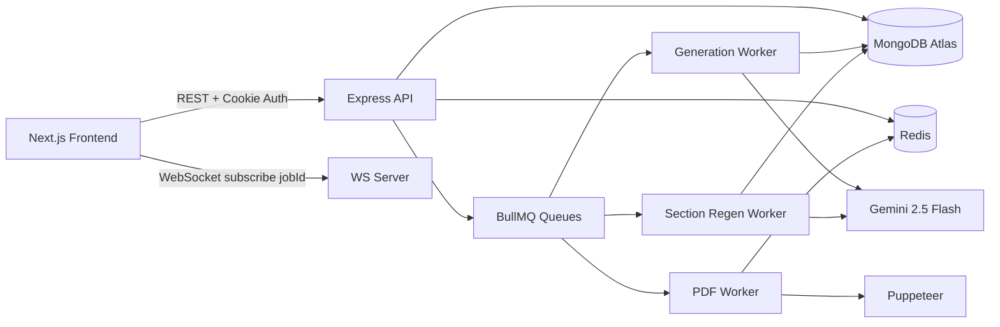

# VedaAI

VedaAI is an AI-powered assessment builder for teachers. It turns curriculum inputs and optional source material (PDF/image) into structured question papers, supports section-level regeneration, and exports print-ready PDFs.

## Highlights

- Full paper generation in minutes with Gemini + strict Zod validation
- Section-level regeneration without losing the rest of the paper
- Real-time status updates over WebSocket with polling fallback
- Queue-based async processing with BullMQ + Redis
- Diagram support (inline SVG or dagre-style node graphs)
- One-click PDF export via Puppeteer

## Tech Stack

- Frontend: Next.js (App Router), TypeScript, Tailwind, Zustand
- Backend: Node.js, Express, TypeScript, ws
- AI: Gemini (`@google/generative-ai`)
- Data: MongoDB + Mongoose
- Queue/Cache: Redis + BullMQ
- File/PDF: Multer, pdf-parse, Puppeteer

## Architecture

### Version 1 (hand-drawn, simple)

Draw a clean, minimal block diagram that shows the core flow only. This is the one to sketch by hand on paper:

1) Browser (Next.js)
2) API + WebSocket (Express)
3) MongoDB + Redis
4) Workers (Generation + PDF)
5) Gemini + Puppeteer

Use arrows like:

Frontend -> API -> DB/Redis
API -> Workers -> Gemini/Puppeteer -> DB/Redis -> Frontend

Keep it simple and readable in a single page.

### Version 2 (detailed, practical)



### Add the hand-drawn PNG to this README

1) Create a folder called `docs/architecture` at repo root.
2) Save your hand-drawn photo as `docs/architecture/arch-v1.png`.
3) Add this markdown in the README where you want the image:

```

```

## System Approach

1) Teacher creates an assignment configuration.
2) Backend stores metadata and enqueues a generation job.
3) Worker builds the prompt, optionally parses uploaded content, and calls Gemini.
4) Response is parsed and validated against strict Zod schemas.
5) Valid paper is stored in MongoDB and cached in Redis.
6) Frontend receives completion or failure via WebSocket (poll fallback is available).
7) Section regeneration re-queues a job and updates only that section.
8) PDF export runs as a separate queue job and streams a downloadable file.

## Project Structure

```text
vedaai/
├─ frontend/      # Next.js app
├─ backend/       # Express API + Workers + WebSocket
├─ docs/          # PRD/UI docs
└─ package.json   # workspace scripts
```

## Local Development

### 1) Prerequisites

- Node.js 18+
- MongoDB (local or Atlas)
- Redis (local or cloud)

### 2) Install dependencies

From repo root:

```bash
npm install
```

### 3) Environment variables

#### backend/.env

```env
PORT=4000
MONGODB_URI=mongodb+srv://...
REDIS_URL=redis://...
JWT_SECRET=your_jwt_secret_min_32_chars
GEMINI_API_KEY=your_gemini_api_key
USE_MOCK_GEMINI=false
UPLOAD_DIR=./uploads
CORS_ORIGIN=http://localhost:3000
```

#### frontend/.env.local

```env
NEXT_PUBLIC_API_URL=http://localhost:4000
NEXT_PUBLIC_WS_URL=ws://localhost:4000
```

### 4) Run services

Terminal 1:

```bash
cd backend
npm run dev
```

Terminal 2:

```bash
cd frontend
npm run dev
```

Frontend: http://localhost:3000
Backend: http://localhost:4000

## Deployment

### Recommended setup

- Frontend on Vercel
- Backend + workers + ws on Render/Railway/Fly
- MongoDB Atlas
- Upstash Redis

### Backend environment variables

```env
NODE_ENV=production
PORT=4000
MONGODB_URI=<atlas-uri>
REDIS_URL=<redis-uri>
JWT_SECRET=<strong-secret>
GEMINI_API_KEY=<gemini-key>
USE_MOCK_GEMINI=false
UPLOAD_DIR=./uploads
CORS_ORIGIN=https://<your-frontend-domain>
```

### Frontend environment variables

```env
NEXT_PUBLIC_API_URL=https://<your-backend-domain>
NEXT_PUBLIC_WS_URL=wss://<your-backend-domain>
```

## API Overview

- POST /api/auth/register
- POST /api/auth/login
- POST /api/auth/logout
- GET /api/assignments
- POST /api/assignments
- GET /api/assignments/:id/paper
- GET /api/assignments/:id/status
- POST /api/assignments/:id/regenerate
- POST /api/assignments/:id/regenerate-section
- POST /api/assignments/:id/export-pdf
- GET /api/assignments/:id/download
- POST /api/upload

## Status

- End-to-end assignment generation pipeline
- Diagram rendering in UI and PDF export
- Section regeneration and queue-based async processing
- Dashboard + assignments + groups + toolkit + library flows
- Error boundaries, toast notifications, skeleton loading states
- Auth protection on all dashboard routes
- Landing page with feature showcase

## License

MIT