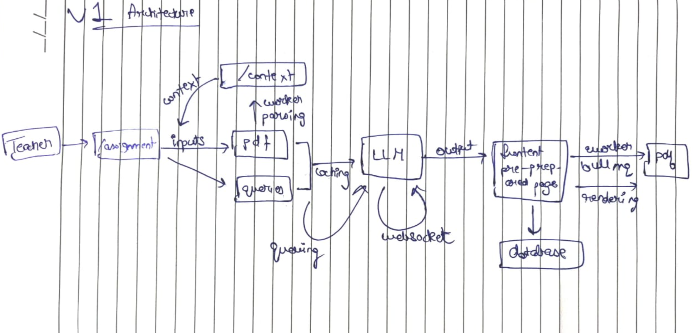
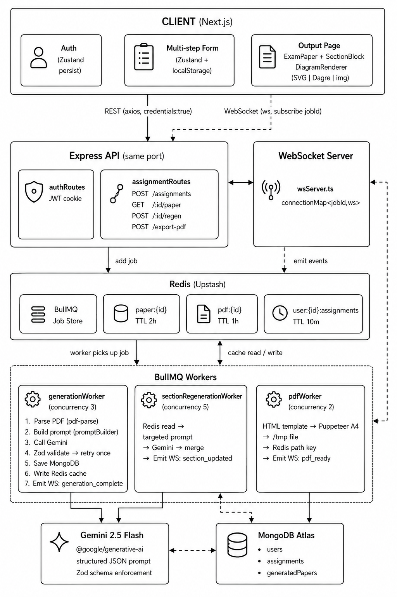

<div align="center">


# VedaAI

### AI-Powered Assessment Creator for Teachers

VedaAI is a full-stack AI-powered assessment generator built for teachers. The system decouples HTTP request handling from long-running AI generation using an async job queue, delivers real-time progress via WebSocket, and caches results in Redis to minimize database load.

</div>

---

# Architecture

## Conceptual Architecture

**Flow**

<div align="center">
  
</div>

---

## Implementation Architecture

Detailed architecture showing worker pools, caching layers, storage, and AI integration.

<div align="center">
  
</div>

---

# Approach

## Asynchronous Generation Pipeline

Assessment generation can take several seconds due to AI processing. Instead of blocking API requests, VedaAI uses BullMQ and Redis to move generation into background workers.

This enables:

- Non-blocking API responses
- Reliable job execution
- Worker-level retries
- Better scalability

---

## Real-Time Progress Updates

A WebSocket server runs alongside Express and allows clients to subscribe to generation jobs.

Workers emit events such as:

```text
generation_complete
section_updated
pdf_ready
generation_failed
```

If the WebSocket connection is unavailable, the frontend automatically falls back to polling.

---

## Section-Level Regeneration

When a teacher regenerates a section, only the selected section is sent back to Gemini instead of the entire paper.

Benefits:

- Lower token consumption
- Faster response times
- Reduced API costs
- Better user experience

---

## Caching Strategy

Redis is used as a high-speed cache layer.

| Key | Purpose | TTL |
|------|----------|-----|
| paper:{id} | Generated paper | 2 Hours |
| user:{id}:assignments | Dashboard data | 10 Minutes |
| pdf:{id} | Temporary PDF path | 1 Hour |

This minimizes repeated database reads and improves response times.

---

## AI Validation Layer

All Gemini responses are validated using Zod schemas before being stored.

```text
Gemini Response
      ↓
JSON Extraction
      ↓
Zod Validation
      ↓
Database Storage
```

Invalid outputs are automatically retried before being marked as failed.

---

## PDF Export

PDF generation is handled by a dedicated worker using Puppeteer.

The same template used for frontend rendering is reused for PDF generation, ensuring visual consistency between the web view and exported document.

---

# Tech Stack

### Frontend

- Next.js
- React
- TypeScript
- Zustand
- Axios

### Backend

- Node.js
- Express.js
- WebSocket (ws)
- BullMQ

### AI

- Gemini 2.5 Flash
- Zod

### Data Layer

- MongoDB Atlas
- Redis (Upstash)

### Document Generation

- Puppeteer

---

# Key Design Decisions

- Background job processing using BullMQ
- Real-time updates through WebSockets
- Redis-backed caching layer
- Section-level AI regeneration
- Schema-validated AI outputs
- Dedicated worker pools for generation and PDF export
