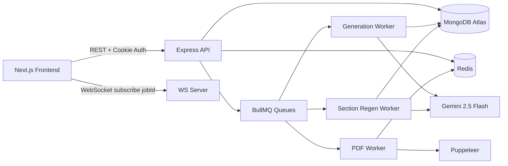

# VedaAI

AI-powered assessment creator for teachers.  
VedaAI helps educators generate structured question papers from curriculum inputs and optional source material (PDF/image), then review, regenerate sections, and export print-ready PDFs.

## Why VedaAI

- Create full exam papers in minutes, not hours
- Support multiple question types: MCQ, short, long, numerical, true/false, diagram
- Use uploaded PDF/image as context for grounded question generation
- Regenerate only weak sections instead of regenerating the whole paper
- Download polished question papers with answer keys as PDF

## Core Features

- Authentication with profile and avatar
- Assignment builder with dynamic question-type configuration
- AI generation with Gemini and strict Zod validation
- Real-time status updates over WebSocket
- Queue-based processing using BullMQ + Redis
- Diagram support (`svg` and graph-style `dagre` data)
- PDF export through Puppeteer

---

## Architecture

### High-level system



### Stack

- **Frontend**: Next.js (App Router), TypeScript, TailwindCSS, Zustand
- **Backend**: Node.js, Express, TypeScript, `ws`
- **AI**: Gemini (`@google/generative-ai`)
- **Data**: MongoDB + Mongoose
- **Queue/Cache**: Redis + BullMQ
- **File/Export**: Multer, pdf-parse, Puppeteer

---

## Approach

1. Teacher creates an assignment configuration.
2. Backend stores assignment metadata and enqueues a generation job.
3. Worker builds prompt, optionally parses uploaded content, calls Gemini.
4. Response is parsed and validated against strict Zod schemas.
5. Valid paper is stored in MongoDB and cached in Redis.
6. Frontend receives completion/failure via WebSocket (poll fallback is available).
7. Teacher can regenerate a single section (token-efficient update).
8. PDF export runs as a separate queue job and streams downloadable file.

---

## Project Structure

```text
vedaai/
├─ frontend/      # Next.js app
├─ backend/       # Express API + Workers + WebSocket
├─ docs/          # PRD/UI docs
└─ package.json   # workspace scripts
```

---

## Local Development

### 1) Prerequisites

- Node.js 18+
- MongoDB (local or Atlas)
- Redis (local or cloud)

### 2) Install dependencies

From repo root:

```bash
npm install
```

### 3) Environment variables

#### `backend/.env`

```env
PORT=4000
MONGODB_URI=mongodb+srv://...
REDIS_URL=redis://...
JWT_SECRET=your_jwt_secret_min_32_chars
GEMINI_API_KEY=your_gemini_api_key
USE_MOCK_GEMINI=false
UPLOAD_DIR=./uploads
CORS_ORIGIN=http://localhost:3000
```

#### `frontend/.env.local`

```env
NEXT_PUBLIC_API_URL=http://localhost:4000
NEXT_PUBLIC_WS_URL=ws://localhost:4000
```

### 4) Run services

Terminal 1:

```bash
cd backend
npm run dev
```

Terminal 2:

```bash
cd frontend
npm run dev
```

Frontend: `http://localhost:3000`  
Backend: `http://localhost:4000`

---

## Deployment (Detailed, Step-by-step)

Recommended production setup:

- **Frontend** on Vercel
- **Backend + workers + ws** on Railway (or Render/Fly)
- **MongoDB Atlas**
- **Redis (Upstash/Redis Cloud)**

### Step 1: Prepare production services

1. Create a MongoDB Atlas cluster and copy connection URI.
2. Create a Redis database (Upstash/Redis Cloud) and copy `REDIS_URL`.
3. Generate a strong `JWT_SECRET` (32+ chars).
4. Keep your `GEMINI_API_KEY` ready.

### Step 2: Deploy backend first

Use Railway/Render and point root directory to `backend`.

#### Backend environment variables (required)

```env
NODE_ENV=production
PORT=4000
MONGODB_URI=<atlas-uri>
REDIS_URL=<redis-uri>
JWT_SECRET=<strong-secret>
GEMINI_API_KEY=<gemini-key>
USE_MOCK_GEMINI=false
UPLOAD_DIR=./uploads
CORS_ORIGIN=https://<your-frontend-domain>
```

#### Build/start commands

- Build: `npm run build`
- Start: `npm run start`

> This starts Express + WebSocket server + imported workers in one process.

### Step 3: Deploy frontend on Vercel

1. Import repository in Vercel.
2. Set project root to `frontend`.
3. Configure environment variables:

```env
NEXT_PUBLIC_API_URL=https://<your-backend-domain>
NEXT_PUBLIC_WS_URL=wss://<your-backend-domain>
```

4. Deploy.

### Step 4: Verify connectivity

1. Open frontend URL.
2. Register/login and create a sample assignment.
3. Confirm:
   - generation status updates
   - output page loads
   - section regenerate works
   - PDF download works

### Step 5: Production hardening checklist

- Keep `USE_MOCK_GEMINI=false`
- Ensure backend supports WebSocket on same domain/port
- Confirm cookie auth and CORS settings match frontend domain
- Monitor Redis availability (queues depend on it)
- Use managed file storage (S3/Cloudinary) if local uploads are ephemeral on host

---

## API Overview

- `POST /api/auth/register`
- `POST /api/auth/login`
- `POST /api/auth/logout`
- `GET /api/assignments`
- `POST /api/assignments`
- `GET /api/assignments/:id/paper`
- `POST /api/assignments/:id/regenerate`
- `POST /api/assignments/:id/regenerate-section`
- `POST /api/assignments/:id/export-pdf`
- `GET /api/assignments/:id/download`
- `POST /api/upload`

---

## Status

VedaAI currently includes:

- End-to-end assignment generation pipeline
- Diagram rendering in UI and PDF export
- Section regeneration and queue-based async processing
- Dashboard + assignments + groups + toolkit + library flows

hi